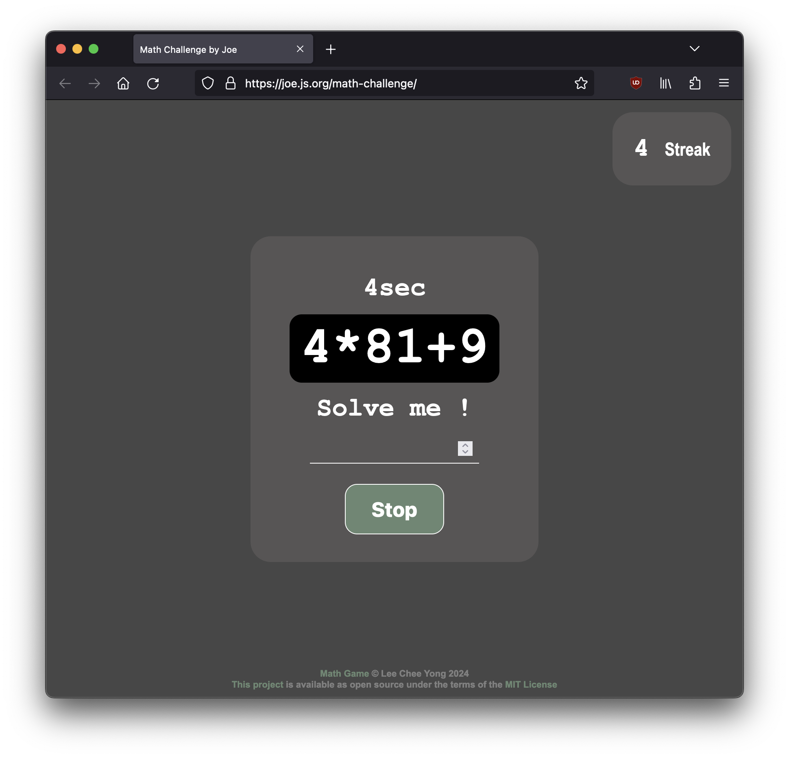

# [Math Challenge](https://leecheeyong.github.io/math-challenge)
A [remastered](https://github.com/leecheeyong/math-game) math challenge game made using Svelte + Vite

## About
- ❔ Random math questions 
- 🔄 Streak count
- ⏰ Time count
- 📶 QPS (Questions per second)

  

<h2>Images</h2>
  

